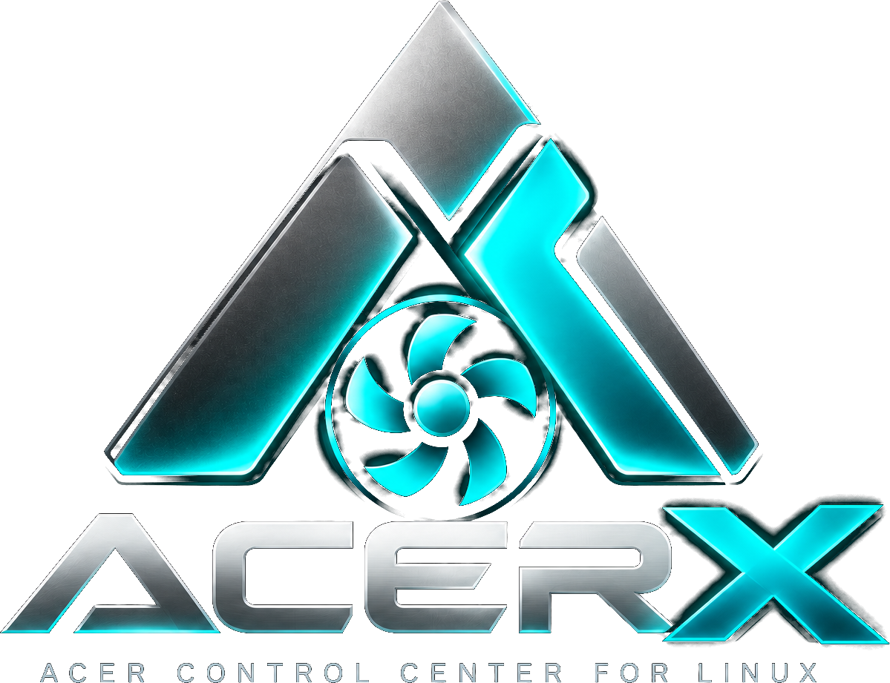
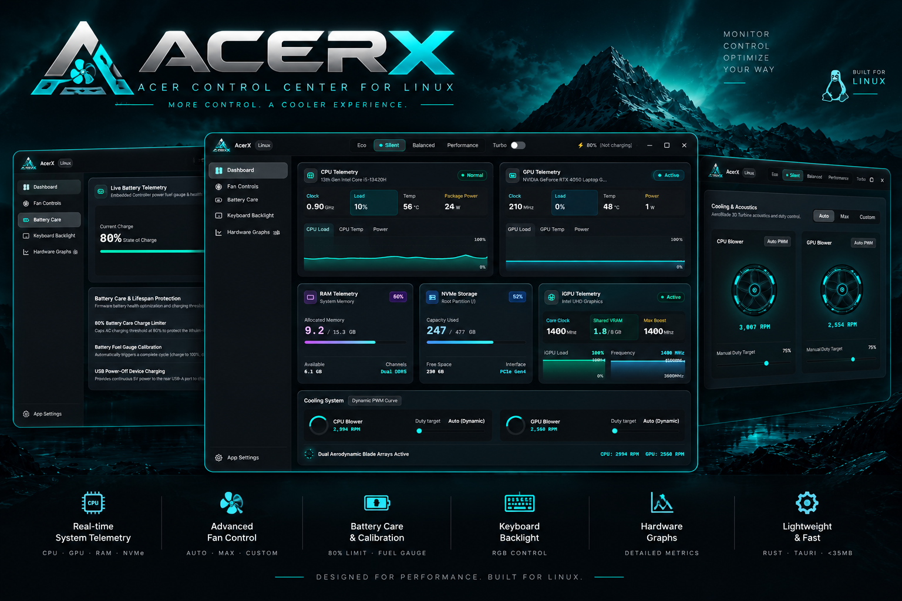

<p align="center">
  
</p>

<h1 align="center">AcerX</h1>
<h3 align="center">Open-Source NitroSense Alternative for Linux — Tailored for Acer Nitro V 15 & Predator Laptops</h3>

<p align="center">
  
  
  
  
  
  
  
</p>

<p align="center">
  
</p>

---

## 📖 Overview

> [!NOTE]
> **AcerX is the premier modern, open-source Linux alternative to Acer NitroSense and PredatorSense.**  
> Engineered and calibrated specifically for the **Acer Nitro V 15** (`ANV15-51` / `ANV15-41`) and compatible Nitro/Predator gaming laptops.

**AcerX** is a unified, lightweight, high-performance hardware management suite engineered specifically for the **Acer Nitro V 15** running Linux.

If you are looking for **NitroSense on Linux**, **Acer Nitro fan control on Linux**, or **Acer thermal management for Linux**, AcerX serves as a complete, drop-in replacement for Windows proprietary tools (NitroSense / PredatorSense). It unites an ACPI/WMI Linux kernel module, an ultra-low-overhead memory-safe **Rust hardware daemon** (`void-controld`), and an aesthetic **Cyberpunk Frosted Glassmorphism interface** (`acer-x`) built with Tauri v2 and React 19.

---

## 📂 Repository Structure

```text
AcerX/
├── app/                    # Tauri v2 + React 19 Desktop Client (acer-x)
│   ├── public/             # Branding assets (logo, icon, animated turbines)
│   ├── src/                # React dashboard, controls, tabs & cyberpunk styles
│   └── src-tauri/          # Tauri Rust bridge, telemetry & IPC client
├── daemon/                 # Privileged Rust Hardware Daemon (void-controld)
│   ├── Cargo.toml
│   ├── void-controld.service
│   └── src/main.rs         # Root sysfs/ACPI controller (<3MB memory footprint)
├── driver/                 # Linuwu-Sense Linux Kernel Driver (C module)
│   ├── Makefile
│   └── src/linuwu_sense.c  # Kernel 6.x & 7.x compatible EC/WMI driver
├── scripts/                # Hardware detection & Nitro key helpers
├── install.sh              # One-click automated production installer
├── uninstall.sh            # Complete uninstaller
├── Compatibility.md        # Tested hardware matrix & EC registers
└── README.md
```

---

## 📚 Quick Documentation Links

* 💻 [**Hardware Compatibility Guide (Compatibility.md)**](Compatibility.md) — Supported Acer models, tested kernels (6.x & 7.x), and platform registers.
* ❓ [**Frequently Asked Questions (FAQ.md)**](FAQ.md) — Nitro key detection, daemon persistence, Secure Boot MOK signing, and troubleshooting.
---

## ✨ Features

* 🌀 **Aerodynamic Cooling**: Live dual-blower RPM tachometers, dynamic EC auto-curves, and custom manual PWM duty sliders.
* ⚡ **ACPI Thermal Envelopes**: Instant switching between **Eco**, **Quiet**, **Balanced**, **Performance**, and **Turbo**.
* 📈 **Simultaneous Dual Graphs**: Real-time independent 60 FPS SVG sparklines tracking **Load (%)** and **Temperature (°C)** concurrently.
* 📊 **Unified Telemetry Suite**: RAM utilization, NVMe disk metrics, GPU VRAM allocation, and dedicated NVIDIA-style Intel iGPU monitor card.
* 🔋 **Dedicated Battery Care**: Hardware 80% charge limiter to preserve battery longevity, gauge calibration, and USB power-off charging.
* 🎨 **Hardware Customization**: 3ms LCD overdrive toggle, keyboard illumination timeout (30s), and BIOS boot chime controls.

---

## 🏛️ Architecture

```text
┌───────────────────────────────────────────────────────────────────┐
│                      AcerX Desktop Client                         │
│             Tauri v2 + React 19 + Tailwind CSS (Adwaita)          │
│                      (Unprivileged User Process)                  │
└─────────────────────────────────┬─────────────────────────────────┘
                                  │ JSON-RPC over Unix Domain Socket
                                  ▼ (/tmp/acerx.sock)
┌───────────────────────────────────────────────────────────────────┐
│                      void-controld Daemon                         │
│           High-Performance, Memory-Safe Rust Daemon (<3MB)        │
│                    (Systemd Root Service Unit)                    │
└──────────────────┬───────────────────────────────┬────────────────┘
                   │ Sysfs WMI / EC                │ ACPI Platform
                   ▼                               ▼
      ┌─────────────────────────┐     ┌─────────────────────────┐
      │   Linuwu-Sense Driver   │     │  /sys/firmware/acpi/    │
      │   (Kernel Module .ko)   │     │    platform_profile     │
      └────────────┬────────────┘     └─────────────────────────┘
                   ▼
┌───────────────────────────────────────────────────────────────────┐
│              Acer Nitro / Predator Embedded Controller            │
└───────────────────────────────────────────────────────────────────┘
```

---

## 🚀 Installation

### Option 1: One-Command Fast Install (Pre-compiled Release)

For users who don't want to install Rust, Node.js, or build from scratch, download and install in a single command:

```bash
curl -sL https://github.com/MonuGurjar/AcerX/releases/latest/download/AcerX-NitroV15-v0.1.0-linux-x86_64.tar.gz | tar -xz && cd AcerX-NitroV15-*-linux-x86_64 && sudo ./install.sh
```

Or step-by-step:
```bash
# 1. Download & extract
wget https://github.com/MonuGurjar/AcerX/releases/latest/download/AcerX-NitroV15-v0.1.0-linux-x86_64.tar.gz
tar -xvf AcerX-NitroV15-v0.1.0-linux-x86_64.tar.gz
cd AcerX-NitroV15-v0.1.0-linux-x86_64

# 2. Run the installer (interactive Nitro key detection included!)
sudo ./install.sh
```

---

### Option 2: Clone & Install from Source

Clone the repository and run the automated installer:

```bash
git clone https://github.com/MonuGurjar/AcerX.git
cd AcerX
sudo ./install.sh
```

The script will automatically:
1. Build and install the `linuwu_sense` kernel module (compatible with Linux 6.x and 7.x kernels).
2. Configure module autoloading on boot (`/etc/modules-load.d/linuwu_sense.conf`).
3. Build and install the `void-controld` daemon with auto-restart systemd unit (`acerx.service`).
4. Interactively detect and register your physical hardware **Nitro** key (`acerx-nitrokey.service`).
5. Install the `acer-x` desktop binary into `/usr/local/bin/acer-x`.
6. Register desktop launcher files and system icons in `/usr/share/applications/` and `/usr/share/icons/hicolor/`.

---

## 🎮 Launching & Dedicated Key Setup

Launch AcerX from your desktop application launcher or run:
```bash
acer-x
```

### Dedicated Nitro / Predator Key
During installation, AcerX offers interactive one-key configuration. If you ever need to reconfigure or change your physical key binding:
```bash
sudo /usr/local/share/acerx/scripts/nitro-key-detection.sh
```
The background daemon `acerx-nitrokey.service` will automatically launch or focus AcerX whenever the physical **N** / **Predator** key is pressed!

---

## 🗑️ Uninstallation

To cleanly remove all AcerX components, daemons, and system services:
```bash
sudo ./uninstall.sh
```

---

## 🛠️ Built for Production

* **Tailored for Acer Nitro V 15**: Tuned fan duty curves, platform power envelopes, and register behaviors specifically for Acer Nitro V 15 hardware (`ANV15-51` / `ANV15-41`).
* **Tauri v2 + React 19 Client**: Re-engineered desktop interface with Tauri v2, React 19, TypeScript, and Tailwind CSS (<35MB RAM).
* **Single-Binary Rust Hardware Daemon (`void-controld`)**: High-performance, memory-safe compiled Rust daemon running as a systemd service consuming under 3MB RAM, communicating over high-speed Unix Domain Sockets (`/tmp/acerx.sock`).
* **Simultaneous Dual Graphs**: Real-time CPU & GPU telemetry with live Load and Temperature SVG sparklines.
* **Full Telemetry Suite**: RAM, NVMe disk, and symmetric Intel iGPU telemetry cards.
* **Dedicated Battery Care**: 80% charge limiter and battery calibration.

---

## 👤 Author

Developed and maintained by **[Monu Gurjar](https://github.com/MonuGurjar)**.

---

## 🙏 Credits & Acknowledgements

### Linuwu-Sense

AcerX uses the Linux hardware driver from
[Linuwu-Sense](https://github.com/0x7375646F/Linuwu-Sense).

We gratefully acknowledge the original developer and contributors of
Linuwu-Sense for their work enabling hardware control and support for
Acer laptops on Linux.

### Div Acer Manager Max

During the development of AcerX, we studied
[Div Acer Manager Max (DAMX)](https://github.com/PXDiv/Div-Acer-Manager-Max)
as a reference for Linux Acer hardware-management workflows and for
exploring how application interfaces can interact with lower-level
hardware-control components.

AcerX is an independent implementation with its own architecture,
codebase, and technology stack, built with Rust, TypeScript, and Tauri.

### Disclaimer

AcerX is an independent community project and is not affiliated with,
endorsed by, or sponsored by Acer, Linuwu-Sense, or Div Acer Manager Max.

---

## 🔍 Search & Discovery Tags
`nitro-sense` • `nitrosense-linux` • `acer-nitrosense` • `acer-nitro-v15` • `predatorsense-linux` • `acer-fan-control` • `linuwu-sense` • `tauri-v2` • `linux-hardware-monitor` • `rust-daemon`

---

## 📄 License

This project is licensed under the **GNU General Public License v3.0**.  
See the [LICENSE](LICENSE) file for complete details.
